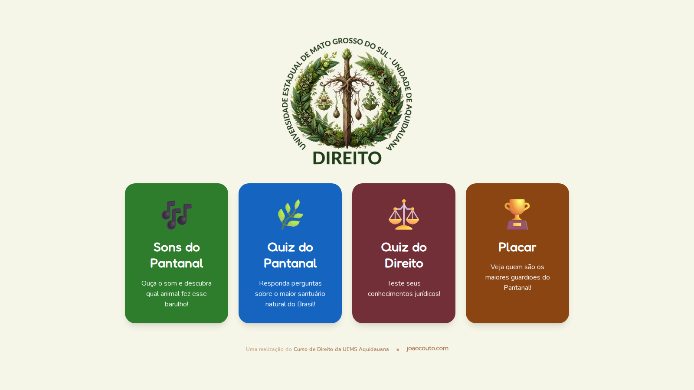
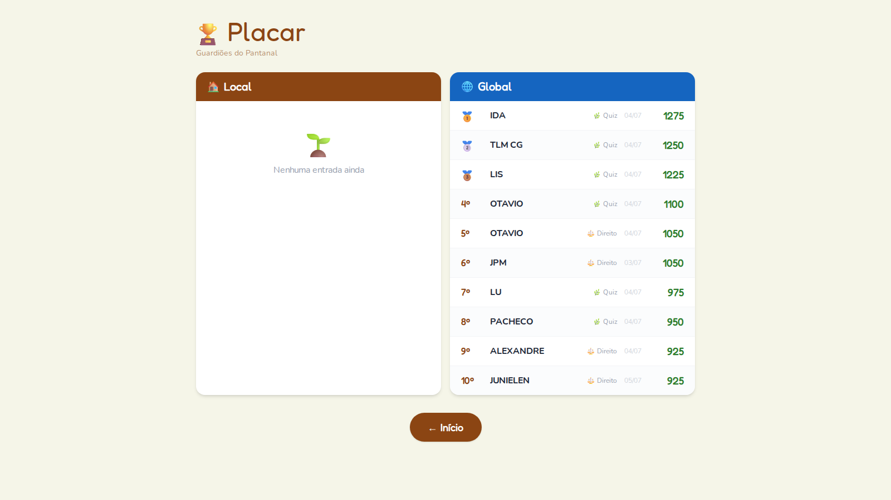
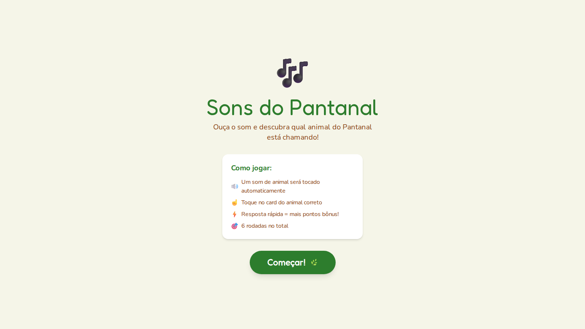
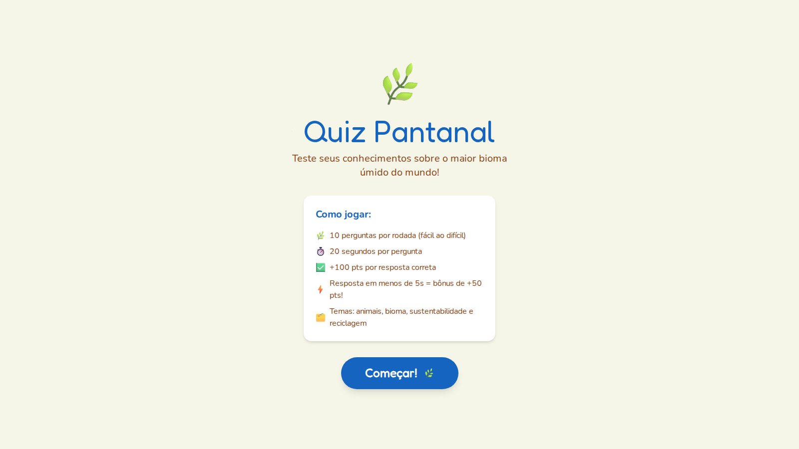
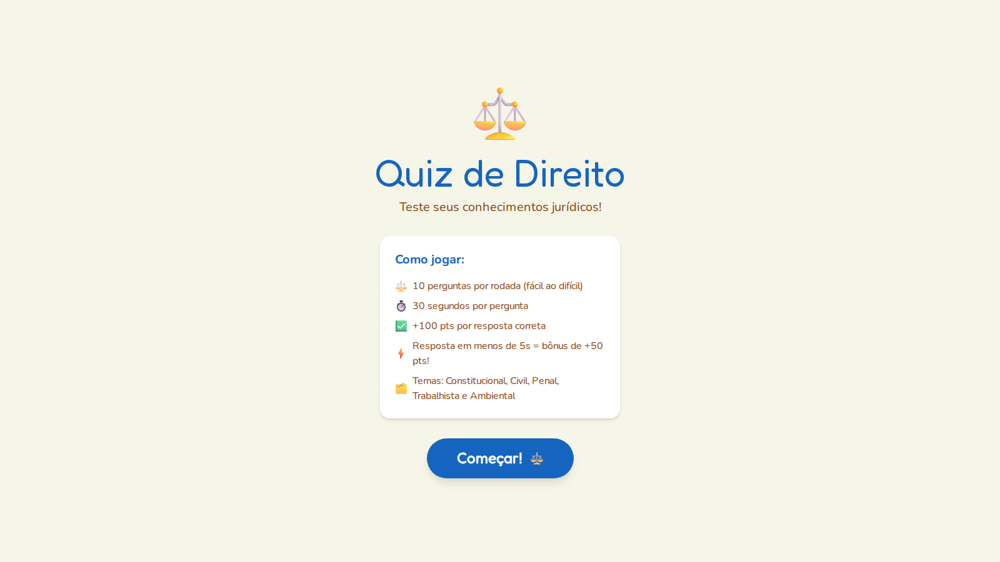

# 🌿 ECO AMIGO

**Juntos por um mundo mais verde!**

App educativo e interativo criado para o stand do **Pantanal Tech** da UEMS, onde crianças de escolas da região — e também bastante gente mais velha — passaram para aprender brincando sobre a fauna e o bioma do Pantanal, acumular pontos e disputar o placar geral.

A mesma plataforma também ganhou uma versão para o **Curso de Direito da UEMS Aquidauana**, com um quiz de conhecimentos jurídicos.

🔗 Produção: [ecoamigo.vercel.app](https://ecoamigo.vercel.app)

---

## Screenshots

| Menu principal                               | Placar (dados reais do evento)         |
| -------------------------------------------- | -------------------------------------- |
|  |  |

| Sons do Pantanal                               | Quiz Pantanal                               | Quiz de Direito                                       |
| ---------------------------------------------- | ------------------------------------------- | ----------------------------------------------------- |
|  |  |  |

O placar acima é o registro real do dia do evento — os nomes no topo são de quem mais fez pontos no stand. 🏆

---

## Jogos

- **🎵 Sons do Pantanal** (`/sons`) — ouça o som de um animal e acerte qual bicho fez aquele barulho, entre 4 opções.
- **🌿 Quiz Pantanal** (`/quiz`) — perguntas de múltipla escolha sobre fauna, bioma, sustentabilidade e coleta seletiva.
- **⚖️ Quiz de Direito** (`/quiz-direito`) — perguntas de múltipla escolha sobre Direito Constitucional, Civil, Penal, Trabalhista e Ambiental.
- **🏆 Placar** (`/placar`) — ranking local (por dispositivo) e ranking global (MongoDB Atlas), lado a lado.

Cada rodada tem tempo por pergunta, pontuação por acerto e bônus por velocidade de resposta.

## Suporte a Gamepad

O app funciona com controle (Xbox/PlayStation) em todas as telas: D-pad/analógico para navegar, botão de confirmar para selecionar e botão de voltar para cancelar — pensado para uso na TV do stand.

---

## Stack Técnica

| Camada                | Tecnologia                                               |
| --------------------- | -------------------------------------------------------- |
| Framework             | Next.js 16 (App Router)                                  |
| Linguagem             | TypeScript                                               |
| Estilo                | Tailwind CSS 4                                           |
| Animações             | Framer Motion (`motion/react`)                           |
| Áudio                 | Howler.js                                                |
| Estado global         | Zustand                                                  |
| Placar local          | localStorage                                             |
| Placar remoto         | MongoDB Atlas (driver nativo `mongodb`)                  |
| PWA                   | Serwist (service worker, instalável, portrait/landscape) |
| Gamepad               | Gamepad API (hook `useGamepad`)                          |
| Filtro de profanidade | `leo-profanity` (+ wordlist pt-BR)                       |
| Rate limiting         | `rate-limiter-flexible` (in-memory)                      |

## Rodando localmente

Pré-requisito: [pnpm](https://pnpm.io).

```bash
pnpm install
cp .env.example .env.local   # preencha MONGODB_URI
pnpm dev
```

Abra [http://localhost:3000](http://localhost:3000). Sem `MONGODB_URI` configurada, o app continua funcionando normalmente — o placar só não sincroniza com o ranking global (fallback local-first).

### Variáveis de ambiente

```env
MONGODB_URI=mongodb+srv://<usuario>:<senha>@<cluster>.mongodb.net/ecoamigo
```

## Proteção do placar

Toda submissão ao ranking global passa por: rate limiting por IP, validação de nome, filtro de profanidade (pt-BR), validação anti-cheat de pontuação máxima por jogo e validação do tipo de jogo. Detalhes completos da lógica em [`CLAUDE.md`](./CLAUDE.md) (obrigado Anthropic).

---

Um projeto para o **Pantanal Tech**, com uma versão a serviço do **Curso de Direito da UEMS Aquidauana**.
